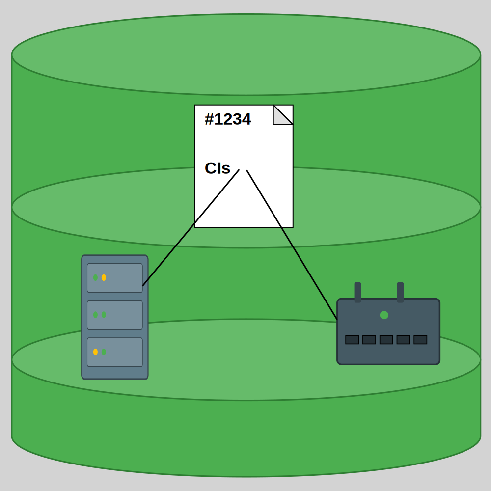

# CMDB Plugin for Redmine

A Configuration Management DataBase (CMDB) plugin for Redmine 6.1+ where you can keep an inventory of your software and hardware items and connect them to tickets.



## Features

- Hierarchy of locations, tree structure
- Hierarchy of Configuration Item classes (CI classes), tree structure
- Multilingual
- Fine-grained access control
- Documentation links 
- Tiki (TikiWiki) integration

## Installation

This is the standard Redmine plugin installation procedure.

1. Copy the plugin into the Redmine plugin dirctory:

   a) If it is already in the current directory:

   ```bash
   cp -r hrz_cmdb /path/to/redmine/plugins/.
   ```
   
   b) If you want a fresh clone of the latest version:
   
   ```bash
   cd /path/to/redmine/plugins
   git clone https://github.com/franz-ap/hrz_cmdb
   ```


2. Install pre-requisites:

   ```bash
   bundle install
   ```

3. Database migration:
   ```bash
   RAILS_ENV=production bundle exec rake redmine:plugins:migrate
   ```

4. Restart Redmine


## Configuration

### Access rights CMDB page

You can skip this step, if only Redmine administrators need to work with the CMDB: define CIs, etc. In that case you would not be able to delegate a part of that CMDB work to your colleagues.

1. Login as Redmine administrator.

2. Make sure, that you have created at least one standard Redmine group.

3. Go to Administration → Plugins

4. Near "CMDB AF" click "Configure"

5. Assign one or more Redmine groups to the three access levels:
   - **View CMDB**: Read only access to the CMDB page
   - **Edit CMDB**: Edit locations and CIs. This right implies "View CMDB". So, there is no need to add persons to both groups.
   - **Edit basic data**:  Hierarchy levels of locations, CI classes. This right implies "View CMDB". So, there is no need to add persons to both groups.

### User rights in tickets

1. Go to Administration → Roles and permissions

2. Grant these CMDB rights to one or more roles:
   - **View CIs in issues**: View the list of CIs that are connected to a ticket.
   - **Manage CIs in issues**: Connect CIs to tickets, remove them from a ticket.

### Add the CMDB module to Redmine project(s)

Enable the module "CMDB" in the settings of one or more Redmine projects, where you wish to connect Configuration Items (CIs) to tickets/issues.
Otherwise you could use the CMDB only standalone.


### Initial data setup

Automatic creation of seed data is available:

- Menu: "CMDB"
- Open folder "Settings" → open "Seed Data"
- There click on the "Add Seed Data" button.

If you prefer to do that manually:

1. **Create at least one location hierarchy level**:
   - Menu: "CMDB"
   - Open folders "Basic Data" → "Location hierarchy"
   - Click on "Create new hierarchy level"
   - Enter data about a new location type into the form, then click "Create new entry".
2. **Create at least one location**:
   - Click on "Create new location"
   - Enter data into the form and choose one of the location types. Click "Create new entry".

In case you do not need all of the seed values and want to get rid of the unused ones (after entering your CIs): 

* Click on the "Remove Unused Seed Data" button.

You can repeat these Add/Remove Seed Data steps whenever you need, even after manual configuration.


## Languages

The plugin supports the following languages:

- bg: български - Bulgarian

- de: Deutsch - German
- el: Ελληνικά - Greek
- en: English
- fr: Français - French    (soon)
- hr: Hrvatski - Croatian
- hu: Magyar - Hungarian
- it: Italiano - Italian   (soon)
- pl: Polski - Polish
- ro: Română - Romanian
- ru: русский - Russian
- sk: slovenský - Slovak   (soon)
- sl: Slovenščina - Slovenian  (soon)
- tr: Türkçe - Turkish
- ua: українська - Ukrainian 


## Uninstall

1. Undo database migration:
   ```bash
   RAILS_ENV=production bundle exec rake redmine:plugins:migrate NAME=hrz_cmdb VERSION=0
   ```

2. Remove plugin directory:
   ```bash
   rm -rf /path/to/redmine/plugins/hrz_cmdb
   ```

3. Restart Redmine.

## Support

Please file an issue: https://github.com/franz-ap/hrz_cmdb/issues

## License


This program is free software: you can redistribute it and/or modify it under the terms
of the **GNU Affero General Public License** as published by the Free Software Foundation,
either version 3 of the License, or (at your option) any later version.

This program is distributed in the hope that it will be useful, but WITHOUT ANY WARRANTY;
without even the implied warranty of MERCHANTABILITY or FITNESS FOR A PARTICULAR PURPOSE.
See the GNU Affero General Public License for more details.

You should have received a copy of the GNU Affero General Public License
along with this program.  If not, see <https://www.gnu.org/licenses/>.

## Versions

The latest version can be found here: https://github.com/franz-ap/hrz_cmdb

In case you wonder, why there is a *"hrz"* prefix: To avoid a potential name clash with other CMDBs. You can read it as *"Home-brewed Redmine-add-on Zone"*.

###### Version 0.7.0  26.10.2025

The Minimum Viable Product. 

It is very basic, but usable. A proof-of-concept. Expect improved versions very soon.
